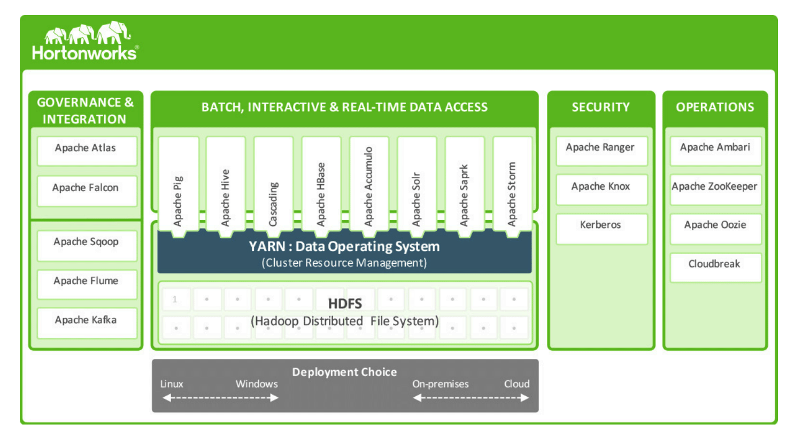
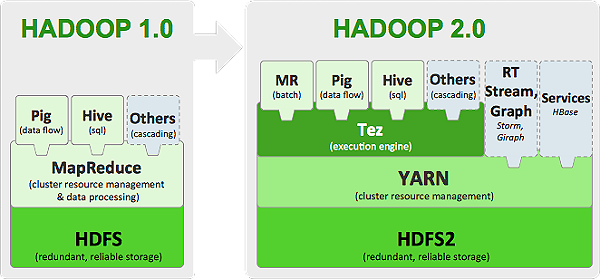
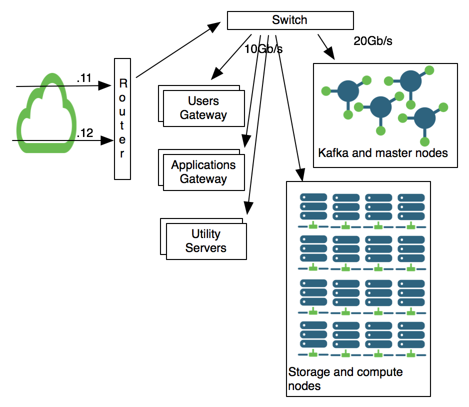

# HortonWorks Data Platform 2.3

The HADOOP ecosystem being especially complex and constently changing, DAPLAB uses
[Hortonworks](http://hortonworks.com/) as its hadoop provider.
[HDP](http://hortonworks.com/products/hdp/) is a secure, enterprise-ready open
source Apache™ Hadoop® distribution based on a centralized architecture (YARN).

In theory, DAPLAB can run any tool delelopped for HADOOP. In practice, it is
necessary to take into account the already installed frameworks as well as the
limitations imposed by HDP.

The HDP architecture is presented in the figure below.

__Hadoop Distributed File System (HDFS)__ and __YARN__ are the cornerstone components of Hortonworks Data Platform (HDP).
HDFS is a distributed file system providing a scalable, fault-tolerant and cost-efficient storage for the data. YARN,
_Yet Another Resource Negotiator_, is a large-scale, distributed operating system for big data applications. It
decouples _MapReduce_'s resource management and scheduling capabilities from the data processing component,
enabling Hadoop to support more varied processing approaches and a broader array of applications.

On top of YARN, it is possible to plug a versatile range of processing engines that ease allows multiple processes to
interact with the same data in multiple ways, at the same time. Most of the tools visible on the figure are discussed
more in depth in our [tutorials](tutorials/index.md) and other resources.

__Ambari__ is a graphical interface to provision, manage and monitor HADOOP clusters easily, while __ZooKeeper__
 provides a distributed synchronization (for maintaining configuration information and naming) through a centralized service.

# About HADOOP 2

Most of the following information have been taken from the articles [_What is Apache Tez?_](https://www.infoq.com/articles/apache-tez-saha-murthy)
and [_Hadoop 2 vs 1_](http://www.tomsitpro.com/articles/hadoop-2-vs-1,2-718.html). We encourage you to read them for more in-depth explanations.
{: .vscc-notify-info }

The major changes between HADOOP 1 and HADOOP 2 are the introduction the introduction of HDFS federation and the resource manager YARN.
There is also a new execution engine, Tez, which  generalizes the MapReduce paradigm to a more powerful framework
based on expressing computations as a _dataflow graph_.

 

In Hadoop 1, a single Namenode managed the entire namespace for a Hadoop cluster.
With __HDFS federation__, multiple Namenode servers manage namespaces and this allows for horizontal scaling,
performance improvements, and multiple namespaces.

 __YARN__ , HADOOP users are no longer limited to working the I/O intensive, high latency MapReduce framework, but can
 run other processing models. YARN also simplifies the management of resources and brings significant performance
 improvements to HADOOP.

 __Tez__ is one of the new processing models of HADOOP 2. It allows developers to build end-user applications (such as
Hive and Pig) with much better performance and flexibility. It gets around some limitations imposed by MapReduce and
makes near-real-time query processing possible.

# DAPLAB architecture

DAPLAB Architecture follows a typical Data Lake architecture.

Users have physical SSH access to so-called __Gateways or Edge servers__, and interact with Hadoop services from there.
Users have also access to user interaces such as [Ambari](ambari_cheat_sheet.md) or [Hue](https://hue.daplab.ch/).
User Gateways have __home directories__ mounted on a SAN via NFS in order to share home folders between gateways.

__Applications__ are either run as long living YARN applications, or have dedicated gateways simply called
Application Gateways. The rational behind that is that Users Gateways tend to have unpredictable workload,
highly correlated to users mood. Applications might require more predictable workload and are thus separated.
Note that these Application and Users Gateways would be good candidates to run on VMs.

The servers running Hadoop & friends are split in two categories with two distinct hardware configurations:
storage and non-storage.

The __storage nodes__ usually contains 12 spinning 2TB drives or more. They have reasonably small SSDs for the OS,
dual E5-XXXX v3 CPUs and 128GB of RAM.
The second type of servers, __non-storage nodes__, have 2 to 4 bigger SSDs and are intended to run master processes such as Zookeeper,
Namenode, Resource Manager as well as Kafka brokers. We also bond two of their NIC to achieve 20Gb/s of bandwidth
between the servers ! <!-- TODO -->

The last type of servers are called __Utility servers__, and are primarily hosting mandatory services to run the
Hadoop platform such as DHCP, DNS, Kerberos, LDAP etc. These ones also run Postgresql in master-slave mode
to store Ambari, Hive, Hue and Oozie databases.

# DAPLAB Hardware

More specifically, DAPLAB currently uses hardware of the following families:

 - [Dell PowerEdge 1850 Server](pdfs/PowerEdge_1850.pdf){:target="_blank"}
 - [Dell PowerEdge 2950 Server](pdfs/PowerEdge_2950.pdf){:target="_blank"}
 - [Dell PowerEdge R230](pdfs/PowerEdge_R230.pdf){:target="_blank"}
 - [Dell PowerEdge R430](pdfs/PowerEdge_R430.pdf){:target="_blank"}
 - [Supermicro SuperServer 6017R-73THDP+](pdfs/SYS-6017R-73THDP.pdf){:target="_blank"}
 - [Supermicro  SuperServer 6028TP-HTTR](pdfs/SYS-6028TP-HTTR.pdf){:target="_blank"}
 - [Supermicro SuperServer F618H6­FTPTL+](pdfs/SYS-F618H6-FTPTL+.pdf){:target="_blank"}
 - [Supermicro X9DRFF­7G+](pdfs/X9DRFF-7G+.pdf){:target="_blank"}
 - [QNAP TS-863U-RP](pdfs/QNAP_TS-863U-RP.pdf){:target="_blank"}

 Below is a summary of their specifications:

 |Number of machines| Hardware        | CPU           | U  | RAM | Disk capacity/U | Disk capacity (total)
 | --------------- |:--------------|:--:|:----|:---------------:|:---------------------:|
 9 | PowerEdge 2950  | Quad-Core Intel Xeon 5300 8 cores | 2 | 32GB | 3x1 TB | 27 TB |
 2 | PowerEdge R230  | Intel® Xeon®, Intel Pentium®, Intel CoreTM i3 16 cores | 1 | 32 GB | 4x2TB | 16TB |
 4 | SuperServer 6017R-73THDP+  |  Intel Xeon E5-2600 v1/v2  24 cores| 1 | 130 GB | 12x2 TB |96 TB |
 1 | SuperServer 6028TP-HTTR  |  Intel Xeon E5-2600 v3 24 cores  | 2 | 130 GB | 8 x 2TB + 4 x 1TB(ssd)  | 20 TB |
 1 | SuperServer F618H6­FTPTL+ |  Intel Xeon E5-2600 v4 32 cores/U  | 4 |  130 GB/U => 520 GB | 4x12x2 TB | 96 TB |
 2 |  X9DRFF­7G+ |  Intel Xeon E5-2600 v2 24 cores | 1 |  130 GB | 12x2TB | 48 TB |
 1 | QNAP TS-863U-RP | Quad-core 64-bit AMD 2.0GHz | 2 | 4GB | 20 TB | 20 TB |

In total, the DAPLAB has __372 cores__ at its disposal, as well as __323 TB__ of disk space and __978 TB__ or RAM!

DAPLAB capacity:  
_Total Cores_ : 72 cores + 32 cores + 96 cores + 24 cores + 96 cores + 48 cores + 4 = __372 cores__  
_Total Disk_  : 27 + 16 + 96 + 20 + 96 + 48 + 20 =  __323 TB__ 
_Total RAM_   : 32 + 32 + 130 + 130 + 520 + 130 + 4 = __978 TB__
{: .vscc-notify-info }
