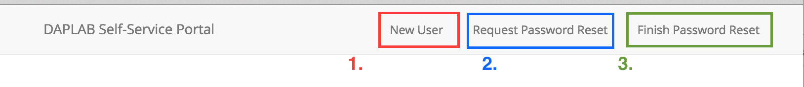

# Accessing the DAPLAB

Quicklinks:<br/>
- [Hue interface -- https://hue.daplab.ch](https://hue.daplab.ch)<br/>
- SSH access `ssh -p 2201 pubgw1.daplab.ch`
{: .vscc-notify-info }


## Pre-requirements

* **SSH client** (for Windows, we recommend the use of [PuTTY](http://www.chiark.greenend.org.uk/~sgtatham/putty/download.html)
  and see [how to create a key with PuTTY](https://www.digitalocean.com/community/tutorials/how-to-use-ssh-keys-with-putty-on-digitalocean-droplets-windows-users))
* **A browser** -- well, if you can access this page, you should have met this requirement :)

## Creating an account

Here are the steps to create a new DAPLAB account:

0. go to [https://portal.daplab.ch](https://portal.daplab.ch){:target="_blank"}



1. select "New User" on the top menubar and fill the form. You will soon receive a
confirmation email.

2. Once the email received, you can go to "Request Password Reset" and enter your
  username. You will again receive an email containing a _token_.

3. Go tot "Finish Password Reset", enter your username as well as the _token_ you
  just received by email. This last step will give you a temporary password.

## First login

Once you get your temporary password, you can log into the gateway via ssh:
```bash
ssh -p 2201 yourusername@pubgw1.daplab.ch
```

A prompt will ask you your temporary password, then ask you for a new one. Please,
ensure your password is strong enough !

The password has to contain letters, numbers and special characters, and can't be based
on a dictionary word.
{: .vscc-notify-warning }

Congrats, you are now a Daplab user !

For enhanced security reasons, we decided to move the SSH port to `2201`. If you
use the ssh config described below, you're not forced to remember this trick.


You can now access the [Hue interface](https://hue.daplab.ch), and login with the username
and password just set. If you lost your password, you can always
[request to re-generate the password](mailto:benoit@daplab.ch?Subject=Password Recovery).
{: .vscc-notify-success }

# SSH keys

In case you don't want to login with a password every time, you can __send your _public_ SSH key__ to [Benoit](mailto:benoit@daplab.ch).

Once done, you can use the tricks described below.


## Environment Setup

The following configuration can be added in your `~/.ssh/config` file:

```
Host pubgw1.daplab.ch
    Port 2201
    PreferredAuthentications publickey,password
    IdentityFile ~/.ssh/id_rsa
    ForwardAgent yes
    ProxyCommand none
    ControlPersist 60s
    ControlMaster auto
    ControlPath ~/.ssh/ssh_control_%h_%p_%r
```

Please update accordingly the parameter `IdentityFile` in the above snippet. You might
also need to set a username using the `User` parameter.
{: .vscc-notify-info }


# DAPLAB Admins Setup

This section is specific to the DAPLAB Admins in order to ease their life accessing
frequently different servers.

In order to access every nodes transparently via the gateway, the following lines can be
added in `~/.ssh/config`:

```
Host daplab-*.fri.lan
    StrictHostKeyChecking no
    ProxyCommand ssh pubgw1.daplab.ch nc %h 22 2> /dev/null
    PreferredAuthentications publickey,password
    IdentityFile ~/.ssh/id_rsa
```

(_mind updating the params, more particularly the ssh key and the User_)

You can then ssh directly into any internal servers:

```
ssh daplab-rt-11.fri.lan
```

To access internal UIs from outside the DAPLAB wifi, you can use [sshuttle](https://github.com/apenwarr/sshuttle):

```bash
sshuttle --dns -r pubgw1.daplab.ch 10.10.10.0/24
```

And then you can ssh to daplab servers as if you where local to the infrastructure;

```bash
ssh daplab-gw-1.fri.lan
```

You are a **MacOS Yosemite User ?**

Then, you need to add an extra route in order to have the setup working properly (more details
[here](http://www.evoila.de/openstack-opensource/running-a-poors-man-vpn-on-yosemite-with-sshuttle-and-ssh/?lang=en)):

```
sudo route add -net 10.10.10.0/24 160.98.23.11
```
