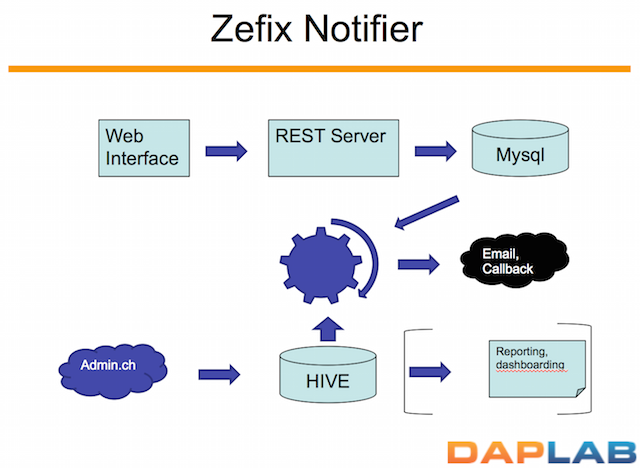

# Hacky Thursday


During Hacky Thursdays, we discuss about big data technologies, have small workshops, invite different Big Data actors to give talks
about pretty much everything interesting.

&nbsp; Hacky Thursday
{: .fa .fa-beer .fa-4x .align-center .display-block }

<div style="margin: 14px auto;
    text-align: center;
    border: 1px solid #2c3e50;
    padding: 10px;">
    <h3>Every Thursdays, 6 pm</h3>
<strong>Haute école d’ingénierie et d’architecture Fribourg</strong><br />
Département d’Informatique <br />
Boulevard de Pérolles 80 – Case postale 32 <br />
CH-1705 Fribourg <br />
</div>

&nbsp;
&nbsp;

Join us on our [HipChat Room](https://daplab.hipchat.com/chat/room/2390200) or use
__this [invitation link](https://daplab.hipchat.com/invite/524027/a32288a838dbfebda031217374b2ea3b)__
if you're not yet in.
{: .align-center}


# Projects

Here is a list of some projects developed/imagined during Hacky Thursdays (most source codes are available on [GitHub](https://github.com/daplab)):

- [Highly available HTTPS](#highly-available-https): deploy a new HTTPS endpoint in less than 30 seconds using open-source softwares;
- [Hive Auto Partitioner](#hive-auto-partitioner): combine Trumpet and Hive and solve a real life Data Engineer problem;
- [Hive Queries in HipChat](#hive-queries-in-hipchat):  allow anyone running Hive queries from a HipChat team room;
- [Notebook](#notebook): a quick tutorial on how to setup a Python Notebook;
- [Nutch crawler](#crawling-internet-with-nutch): a production ready Web Crawler;
- [SwissSim](#swisssimilarities): an application to process 1 billion molecules stored in a Cassandra cluster via Spark;
- [Zefix Notifier](#zefix-notifier): ingestion of data from the Central Business Names Index of Switzerland.

More details below.


# Project details and other cool stuff

### Highly available HTTPS

What is the common point between

* [https://docs.daplab.ch](https://docs.daplab.ch)
* [https://api.daplab.ch](https://api.daplab.ch)
* [https://admin.daplab.ch](https://admin.daplab.ch)
* [https://swisssim.daplab.ch](https://swisssim.daplab.ch)

etc... ?

They all share the same, wildcard SSL certificate. Right! But they also all follow the same path to reach out the final destination.

The goal of this project is:

* Have (valid) SSL everywhere to avoid writing documentation full of `curl -k`
* Deploy a new HTTPS endpoint in less than 30 seconds
* Be highly available up to the destination endpoint (the HA property of the endpoint is not covered here)
* Use open-source softwares, of course.

There're dozen of approaches to achieve that, all of them having pros and cons. And for every solution, a dozen
of different softwares can do the job.

In the case of the DAPLAB, no servers have public IPs, they are all hidden behind a router on a private subnet
so we have to heavily rely on destination NAT. Don't be surprised to see port 443 being NAT'ed in the approach.

The approach implemented to meet these requirements includes the following components that will be detailed below.

* SSL termination
* A floating IP, also know as [VRRP](https://en.wikipedia.org/wiki/Virtual_Router_Redundancy_Protocol)
* A DNS failover

{: width=720px }

__SSL Termination__

SSL Termination is a way of handling SSL overhead (hand-shake, encryption, etc) in one place, and for this proxy
forwarding plain traffic to the destination endpoint. This obviously should be exclusively done in trusted environments.

For this implementation, we used [Nginx](http://nginx.org/).

From Nginx, the clear (de-ssl'ized) traffic can be redirected to virtually everywhere, including
loadbalancing between several backend servers.

__Floating IP__

A floating IP is an IP shared between two or more servers, but only active to one at the same time. The servers
run a sort of coordination between them to decide which one is active, and the active one is replying to
ARP requests for that IP.
Once the active server is down and another detects that, it starts claiming to be the owner of the IP and start
getting the traffic.

This is a fairly easy technique to achieve high availability on an IP address.

We used the defacto [keepalived](http://keepalived.org/) service for that purpose.

__Deployment of a new endpoint__

In order to deploy new endpoints, we rely on Ansible to push the new nginx config as well as add the new dns entry in the zone.

__Area of improvements__

* IP source logging at the destination endpoint. As of today, the destination endpoint sees only the SSL termination
  ip address, which might be a bit embarrassing to compute the access of unique ips :)

-----------------------------------------------

### Hive Auto Partitioner

When ingesting data is not designed from ground up with [Hive](https://hive.apache.org)
in mind, it might quickly become painful go manage partitions on top of the folders.

Think about the following use case: team A is ingesting data via their prefered
path, and team B want to create an external Hive table around the data ingested
by team A. You might told me that team A should only deal with Hive-ready data, and
I would agree, but the reality is slightly different.

As a result, team B will start polling recursively team A directories and create
partitions when new folders are discovered. Repeate that multiple times with
several teams, and you start having a significant amount of RPC calls in HDFS
only for creating Hive partitions. Does it worth the price?

The answer obviously is not, and there is and awesome tool (disclaimer: I'm
part of the author of the tools, so I might be slightly baised :)) which is
solving this problem in an elegant way. The tool is called [Trumpet](https://github.com/verisign/trumpet)
and act as a sort of [iNotify](https://en.wikipedia.org/wiki/Inotify) for HDFS.
Instead of polling for files and directories creation or change, you can subscribe
to the event stream and got notified in case of interest.

The idea of this project is to combine Trumpet and Hive and solve a real life
Data Engineer problem.

The project is hosted in Github and all the implementations details are captured:

* **[https://github.com/daplab/hive-auto-partitioner](https://github.com/daplab/hive-auto-partitioner)**


------------------------------------------------------------

### Hive Queries in HipChat

[ChatOps](http://blogs.atlassian.com/2016/01/what-is-chatops-adoption-guide/) is huge these days
<sup>[[1](http://sdtimes.com/chatops-is-taking-over-enterprises/)]</sup>.
[DAPLAB](http://daplab.ch) is no exception to that trend. Concretely, we're using
[HipChat](https://www.hipchat.com/) during our [HackyThursday](http://daplab.ch/#hacky).

To integrate ChatOps with Data, the idea of the project was to allow anyone running
[Hive](https://hive.apache.org/) queries from our [HipChat team room](https://daplab.hipchat.com/chat/room/2390200)


See the [GitHub page](https://github.com/daplab/HiveQLBot) for all the details!

__Pointers__

* Github repo: [https://github.com/daplab/HiveQLBot](https://github.com/daplab/HiveQLBot)

------------------------------------------------
### Notebook

Here is a quick tutorial on how to create a Python Notebook.

__Enable python 2.7__

```
module load python2.7
```

__Launch your own notebook__

```
jupyter notebook --no-browser --ip=localhost --port=1234
```

__Tunnel to your notebook__

```
ssh -L1234:localhost:1234 pubgw1.daplab.ch
```

Mind adapting the port to what you have set before, since only one user can use the same port.
{: .vscc-notify-info }


__Access your notebook__

Open in your browser [http://localhost:1234](http://localhost:1234)


__Bonus__

Run your notebook in a [screen]() to make it resilient to network
failures (i.e. your notebook won't be killed if you disconnect from ssh)

```
screen -S "jupyter"
```

See the [screen manual](https://www.gnu.org/software/screen/manual/screen.html){:target="_blank"} for more details on how to use `screen`.

------------------------------------------------

### Crawling Internet with Nutch


__Pointers__

* [Apache Nutch](http://nutch.apache.org/)
* [Nutch Tutorial](https://wiki.apache.org/nutch/NutchTutorial)

__Get started__

First, export some environment variables:
```
export HADOOP_CONF=/etc/hadoop/conf
export NUTCH_HOME=/usr/local/apache-nutch
export HADOOP_CLASSPATH=.:$NUTCH_HOME/conf:$NUTCH_HOME/runtime/local/lib
export PATH=$PATH:/usr/local/apache-nutch/runtime/deploy/bin
export NUTCH_CONF=/usr/local/apache-nutch/conf
```

Then, run nutch:
```
> nutch
> crawl urlsdir crawl 1
```

------------------------------------------------------

### SwissSimilarities


If you ever thought about wiring Spark and Cassandra in a real-life project, this is for you. We do process 1 billion molecules stored in a Cassandra cluster via Spark. And it works great!

__Pointers__

* Github repo: [https://github.com/daplab/swisssim](https://github.com/daplab/swisssim)
* Detailed presentation: [https://github.com/daplab/swisssim/raw/master/SwissSimilarity.pdf](https://github.com/daplab/swisssim/raw/master/SwissSimilarity.pdf)


---------------------------------------------------------

### Zefix Notifier


In this project, we’ll ingest data from the Central Business Names Index of Switzerland
(Zentraler Firmenindex, or Zefix in short). We’ll also let any user enter some keywords,
which we’ll match with the new data ingested,
and notify (via email or callbacks) when a match is found.



__Pointers__

* Github repo: [https://github.com/daplab/zefix-notifier](https://github.com/daplab/zefix-notifier)
* Detailed presentation: [http://daplab.ch/wp-content/uploads/2015/10/Zefix.pptx](http://daplab.ch/wp-content/uploads/2015/10/Zefix.pptx)
