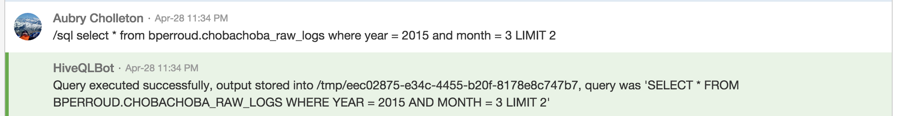

Hive Queries in HipChat
=======

[ChatOps](http://blogs.atlassian.com/2016/01/what-is-chatops-adoption-guide/) is huge these days
[[1](http://sdtimes.com/chatops-is-taking-over-enterprises/)].
[DAPLAB](http://daplab.ch) is no exception to that trend. Concretely, we're using
[HipChat](https://www.hipchat.com/) during our [HackyThursday](http://daplab.ch/#hacky). 

To integrate ChatOps with Data, the idea of the project was to allow anyone running
[Hive](https://hive.apache.org/) queries from our [HipChat team room](https://daplab.hipchat.com/chat/room/2390200)

See the [GitHub page](https://github.com/daplab/HiveQLBot) for all the details!

## Pointers

* Github repo: [https://github.com/daplab/HiveQLBot](https://github.com/daplab/HiveQLBot)

If you find cool writing such piece of software, join us every Thursday evening for our weekly [Hacky Thursdays](http://daplab.ch/#hacky)!
{: .vscc-notify-info }
