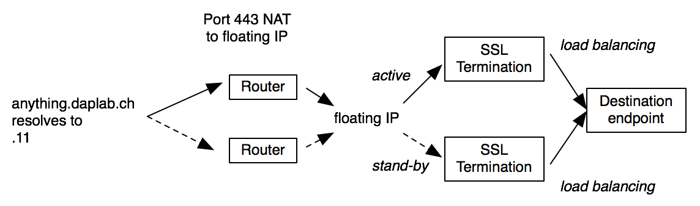

# Introduction

What is the common point between

* [https://docs.daplab.ch](https://docs.daplab.ch)
* [https://api.daplab.ch](https://api.daplab.ch)
* [https://admin.daplab.ch](https://admin.daplab.ch)
* [https://swisssim.daplab.ch](https://swisssim.daplab.ch)

etc... ?

They all share the same, wildcard SSL certificate. Right! But they also all follow the same path to reach out the final destination.

The goal of this project is:

* Have (valid) SSL everywhere to avoid writing documentation full of `curl -k`
* Deploy a new HTTPS endpoint in less than 30 seconds
* Be highly available up to the destination endpoint (the HA property of the endpoint is not covered here)
* Use open-source softwares, of course.

There're dozen of approaches to achieve that, all of them having pros and cons. And for every solution, a dozen
of different softwares can do the job.

In the case of the DAPLAB, no servers have public IPs, they are all hidden behind a router on a private subnet
so we have to heavily rely on destination NAT. Don't be surprised to see port 443 being NAT'ed in the approach.

The approach implemented to meet these requirements includes the following components that will be detailed below.

* SSL termination
* A floating IP, also know as [VRRP](https://en.wikipedia.org/wiki/Virtual_Router_Redundancy_Protocol)
* A DNS failover

{: width=720px }

# SSL Termination

SSL Termination is a way of handling SSL overhead (hand-shake, encryption, etc) in one place, and for this proxy
forwarding plain traffic to the destination endpoint. This obviously should be exclusively done in trusted environments.

For this implementation, we used [Nginx](http://nginx.org/).

From Nginx, the clear (de-ssl'ized) traffic can be redirected to virtually everywhere, including
loadbalancing between several backend servers.

# Floating IP

A floating IP is an IP shared between two or more servers, but only active to one at the same time. The servers
run a sort of coordination between them to decide which one is active, and the active one is replying to
ARP requests for that IP.
Once the active server is down and another detects that, it starts claiming to be the owner of the IP and start
getting the traffic.

This is a fairly easy technique to achieve high availability on an IP address.

We used the defacto [keepalived](http://keepalived.org/) service for that purpose.

# Deployment of a new endpoint

In order to deploy new endpoints, we rely on Ansible to push the new nginx config as well as add the new dns entry in the zone.

# Area of improvements

* IP source logging at the destination endpoint. As of today, the destination endpoint sees only the SSL termination
  ip address, which might be a bit embarrassing to compute the access of unique ips :)
