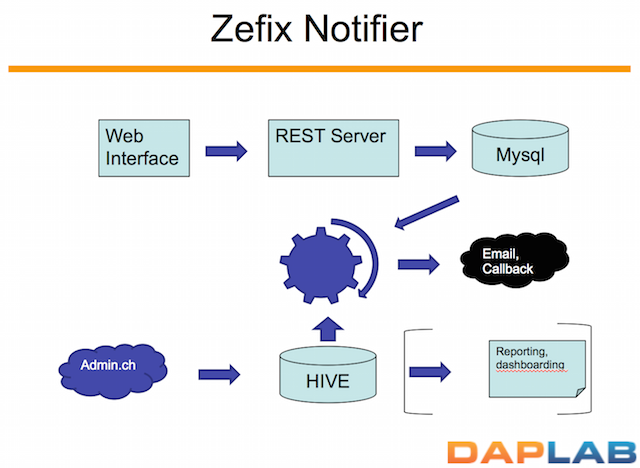

Zefix Notifier
========

## Pointers

* Github repo: [https://github.com/daplab/zefix-notifier](https://github.com/daplab/zefix-notifier)
* Detailled presentation: [http://daplab.ch/wp-content/uploads/2015/10/Zefix.pptx](http://daplab.ch/wp-content/uploads/2015/10/Zefix.pptx)

## Abstract

In this project, we’ll ingest data from the Central Business Names Index of Switzerland
(Zentraler Firmenindex, or Zefix in short). We’ll also let any user enter some keywords,
which we’ll match with the new data ingested,
and notify (via email or callbacks) when a match is found.

If you find cool writing such piece of software, join us every Thursday evening for our weekly [Hacky Thursdays](http://daplab.ch/#hacky)!
{: .vscc-notify-info }
