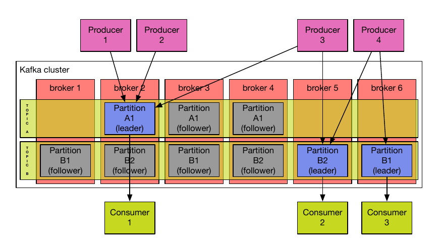

This tutorial assumes you have a [proper environment setup](/getting_started.md)
to access the DAPLAB cluster.
{: .vscc-notify-info }

This page aims at creating a "copy-paste"-like tutorial to publish and receive your first
[Kafka](https://kafka.apache.org) messages.

-----------------------------------------------------
# Introduction

Apache Kafka is a distributed, partitioned, replicated commit log service. It is designed to be
elastic and easy to extend: it is possible to add machines, called __brokers__ to a Kafka __cluster__
without interruption.

 Within a cluster (a group of machines/brokers), Kafka maintains feeds of messages in categories called __topics__.
 Each topic is divided into one or more __partitions__, where messages are stored. Multiple partitions is are
 interesting when a topic expects a large amount of messages, since each partition is handled by one broker.
 Multiple brokers thus means more storage space and, more importantly, parallelized treatment.

     

In the above figure, topic A has one partition replicated twice. Topic B has two partitions, also replicated twice.
Thus, each partition has a _leader_, responsible of any read/write operation initialized by consumers/producers, and
two _followers_, which hold a passive replica of the data. In case the leader fails, one of the two followers is
ready to take its place. The same broker can be leader and follower for different partitions.

__Producers__ publish data into a topic of their choice. They are also responsible for choosing which message
is attributed to which partition. They can thus choose their approach for load balancing. By default, Kafka will
distribute data at random between partitions. When a new message is added to a partition, it receives a unique
sequential numeric identifier called an __offset__. Thus, ordering within a partition is guaranteed, but not
across partitions.

__Consumers__ retrieve messages in a _pulling fashion_. They can choose one of two messaging models, _queuing_ or
_publish-subscribe_, through the notion of __consumer groups__.
In short each consumer labels itself with a _consumer group_ name. If multiple consumers have the same consumer
group, then you have a traditional queuing system: each message is treated by one consumer only (load-balancing - for this to work well, you should have as many consumers as you have partitions inside the topic).
If multiple consumer groups exist, then you have a publish-subscribe system: all messages are broadcasted to all
consumers. You can of course mix the two approaches.


The figure above represents a two server (brokers) Kafka cluster hosting four partitions (P0-P3) with two consumer groups.
Consumer group A has two consumer instances and group B has four. Group A and Group B use the publish-subscribe feature,
while consumers inside each group use the queuing feature.

For more information about how Kafka works, have a look at the [documentation](http://kafka.apache.org/documentation.html#introduction).

-----------------------------------------------------


# Resources

* [http://sookocheff.com/post/kafka/kafka-in-a-nutshell/](http://sookocheff.com/post/kafka/kafka-in-a-nutshell/)
* [https://gist.github.com/ashrithr/5811266](https://gist.github.com/ashrithr/5811266)
* [http://blog.cloudera.com/blog/2014/09/apache-kafka-for-beginners/](http://blog.cloudera.com/blog/2014/09/apache-kafka-for-beginners/)
* [http://kafka.apache.org/documentation.html](http://kafka.apache.org/documentation.html)

# Terminology

Here is the basic terminology we'll use throughout the tutorial:

- Kafka is run as a cluster comprised of one or more servers each of which is called a _broker_.
- Kafka maintains feeds of messages in categories called _topics_.
- A _producer_ is a process that publish messages to a Kafka topic.
- A _consumer_ is a process that subscribes to topics and process the feed of published messages.


# Consumers

Kafka has two types of consumers: Group Consumers and Simple Consumer.

* Group Consumer provides high-level abstraction to read from topics, with less
  fine-grained control over what you're doing.
* Simple Consumer on the other hand provides really low API to read from anywhere within
  a partition, but lots or retry logic is deferred to the caller.

It's thus always a trade-off to decide which one to pick, depending what you're trying
to build. Lots of softwares are using both Simple and Group consumer,
depending the task to achieve.

# Before Starting: Zookeeper config

_Side note_: it is important to have some way to coordinating tasks, state management, configuration, etc across a distributed system.
While some projects build their own mechanisms, Kafka relies on Zookeeper for coordination.

All the following examples assume you're running on the DAPLAB infrastructure.
We're setting the servers into variable for sake of clarity and
protability in the examples below.

```
ZK="daplab-wn-22.fri.lan,daplab-wn-25.fri.lan,daplab-wn-33.fri.lan"
BROKERS="daplab-rt-11.fri.lan:6667,daplab-rt-12.fri.lan:6667,daplab-rt-13.fri.lan:6667,daplab-rt-14.fri.lan:6667"
```

# Listing existing topics

```bash
/usr/hdp/current/kafka-broker/bin/kafka-topics.sh --zookeeper $ZK --list
```

# Create a new topic

```bash
/usr/hdp/current/kafka-broker/bin/kafka-topics.sh --create \
  --zookeeper $ZK \
  --replication-factor 2 \
  --partitions 1 \
  --topic test-$(whoami)
```

Mind that this example creates a topic with **one single** partition.
You can obviously create more partitions within your topic, but the consuming examples
must be slightly adapted.
{: .vscc-notify-warning }

# Publishing messages

```bash
echo -e "message1\nmessage2\nmessage3" | /usr/hdp/current/kafka-broker/bin/kafka-console-producer.sh \
  --broker-list $BROKERS \
  --topic test-$(whoami)
```

# Read topic offset

This command line call helps you validating if your messages have been properly published

```bash
/usr/hdp/current/kafka-broker/bin/kafka-run-class.sh kafka.tools.GetOffsetShell \
  --broker-list $BROKERS \
  --time -1 \
  --topic test-$(whoami)
```

# Reading messages

Read the 3 first messages from partition 0 of the topic:

```bash
/usr/hdp/current/kafka-broker/bin/kafka-simple-consumer-shell.sh \
  --broker-list $BROKERS \
  --topic test-$(whoami) \
  --offset -2 \
  --max-messages 3 \
  --partition 0
```

Read the first 3 messages of the topic, if you have more than one partition

```bash
/usr/hdp/current/kafka-broker/bin/kafka-console-consumer.sh \
  --zookeeper $ZK \
  --topic test-$(whoami) \
  --from-beginning \
  --max-messages 3
```

## Java Code

Please checkout [Kafka Starter](https://github.com/daplab/kafka-starter) project
to get a complete Java, Maven-based project to import in your IDE, including
embedded Kafka server for testing.

```bash
## Clone the project
git clone https://github.com/daplab/kafka-starter.git

## Build it
mvn clean install
```


<!--
# New Consumer API

http://www.confluent.io/blog/tutorial-getting-started-with-the-new-apache-kafka-0.9-consumer-client

org.apache.kafka.clients.consumer.CommitFailedException: Commit cannot be completed due to group rebalance
  at org.apache.kafka.clients.consumer.internals.ConsumerCoordinator$OffsetCommitResponseHandler.handle(ConsumerCoordinator.java:552) ~[kafka-clients-0.9.0.1.jar:na]

Long message processing time and consumer liveness

i.e. use pause and resume.

Mind threads.-->
