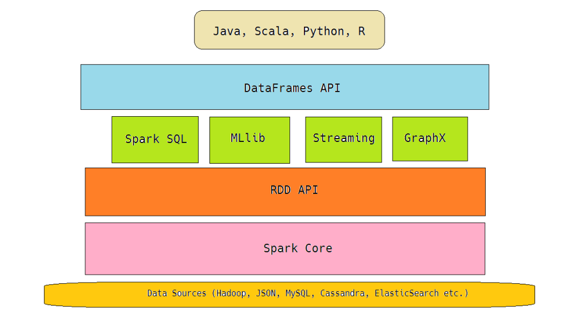

This tutorial assumes you have a [proper environment setup](/getting_started.md)
to access the DAPLAB cluster.
{: .vscc-notify-info }

This page aims at creating a "copy-paste"-like tutorial to run your first
[Spark](https://spark.apache.org) job.

-------------------------------------
# Introduction

From the [docs](https://spark.apache.org/docs/1.5.1/){:target="\_blank"}, Apache Spark is a fast and general-purpose cluster computing system. It provides high-level APIs in Java, Scala, Python and R, and an optimized engine that supports general execution graphs. It also supports a rich set of higher-level tools including Spark SQL for SQL and structured data processing, MLlib for machine learning, GraphX for graph processing, and Spark Streaming.

Spark makes it easier to write MapReduce jobs and offers connectors to a large array of data sources, such as HDFS, Cassandra, HBase, and S3.



# Spark basic concepts

A Spark application is made of a __driver program__, which runs the _main_ function and launches __parallel operation__ on a cluster.
One of the key concepts is the __resilitent distributed dataset (RDD)__, a collection of elements partitioned across the nodes of the cluster that can be operated in parallel.
An RDD can be created from a file stored in a supported file system (like HDFS), from a source (Cassandra, Kafka) or from an existing collection. Parallel operations always
consist of a transformation of some RDD.
RDDs can be persisted in memory for better efficiency when reused across parallel operation (they are serialized and sent across the cluster by default) and, more important, they _automatically recover_ from node failure.

When Spark runs a function in parallel, it ships _a copy_ of each variable the function uses. If your program needs to share variables across tasks, it must explicitly state so by creating and using either a __broadcast variable__ or an __accumulator__. Broadcast variables are read-only shared variables cached in memory on all nodes, while accumulators are variables that can be "added" to (counters, sum, etc.).


-------------------------------------


# Resources

* The [official Spark documentation](https://spark.apache.org/docs/1.5.1/) is an
  excellent starting point.

# Running Spark

The following command will run the HDP version of Spark, 1.5.1 at the time of writing.

```bash
spark-shell --master yarn-master --conf spark.ui.port=$(shuf -i 2000-65000 -n 1)

  ...
  Welcome to
      ____              __
     / __/__  ___ _____/ /__
    _\ \/ _ \/ _ `/ __/  '_/
   /___/ .__/\_,_/_/ /_/\_\   version 1.5.1
      /_/
```

# First Example

```scala
val meteodata = sc.textFile("hdfs://daplab2/shared/meteo/2015/06/28/*")
meteodata.count()
```

Woot! Enjoy running Spark!


# SparkSQL

[SparkQL](https://spark.apache.org/sql/) is a module of Spark to work with structured data,
i.e. data is an associated schema or metadata. It is seamlessly associated with Hive.
The following few lines show how query Hive from Spark:

```scala
// (inside Spark repl)
val sqlContext = new org.apache.spark.sql.hive.HiveContext(sc)

sqlContext.sql("FROM meteo SELECT date, temperature, station WHERE station = 'SMA'")
  .collect().foreach(println)
```

Or, as an example, you can filter in Spark instead of in Hive:

```scala
sqlContext.sql("FROM meteo SELECT date, temperature, station").filter(r => r(2) == "SMA")
  .collect().foreach(println)
```

* TODO: what is the different execution plan between filtering in Hive versus filtering in Spark?


## Integration with Cassandra

Run the command above with the following additional parameters:

`--jars /tmp/sparssandra-1.0.0-SNAPSHOT.jar --conf spark.cassandra.connection.host=cassandra1.fri.lan`

Altogether, the command to launch spark is:

```bash
spark-shell  --master yarn-master --conf spark.ui.port=$(shuf -i 2000-65000 -n 1) \
  --jars /tmp/sparssandra-1.0.0-SNAPSHOT.jar \
  --conf spark.cassandra.connection.host=cassandra1.fri.lan
```

Now in Spark shell, import the drivers, and query the table :)

```scala
import com.datastax.spark.connector._

val r = sc.cassandraTable("test_bperroud", "countercf").collect().foreach(println)
```

# Understand Closures

## What not to do

Don't do this

```
// this runs in the driver
val foo = new SomeExpensiveNotSerializableThing
someRdd.map { x =>
  // this runs in the executor, so...
  // the attempt to close over foo will throw NotSerializableException
  foo.mangle(x)
}
```

Don't do this either

```
someRdd.map { x =>
  // this runs in the executor, ok...
  // but gets constructed for every element in the RDD, so will be slow
  val foo = new SomeExpensiveNotSerializableThing
  foo.mangle(x)
}
```

## What to do

Do this instead:

```
someRdd.mapPartitions { part =>
  // this runs in the executor, constructed only once per group of elements
  val foo = new SomeExpensiveNotSerializableThing
  part.map { x =>
    // then used for each element
    foo.mangle(x)
  }
}
```
