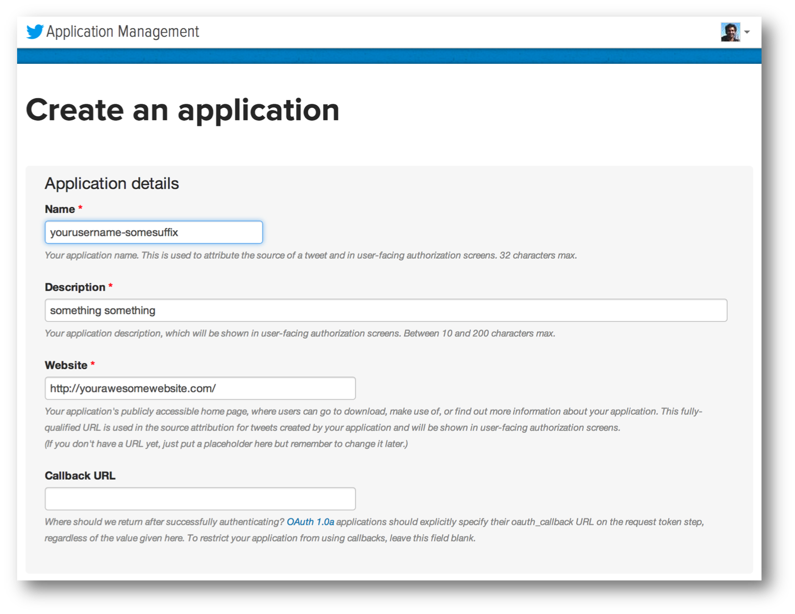
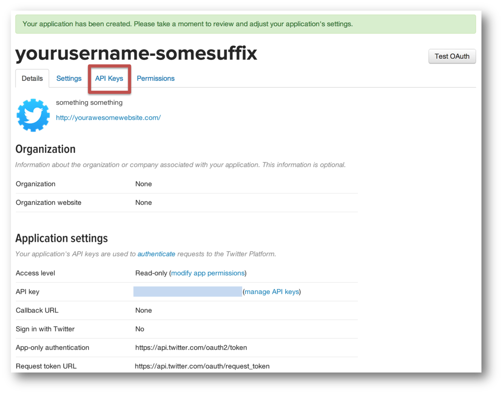
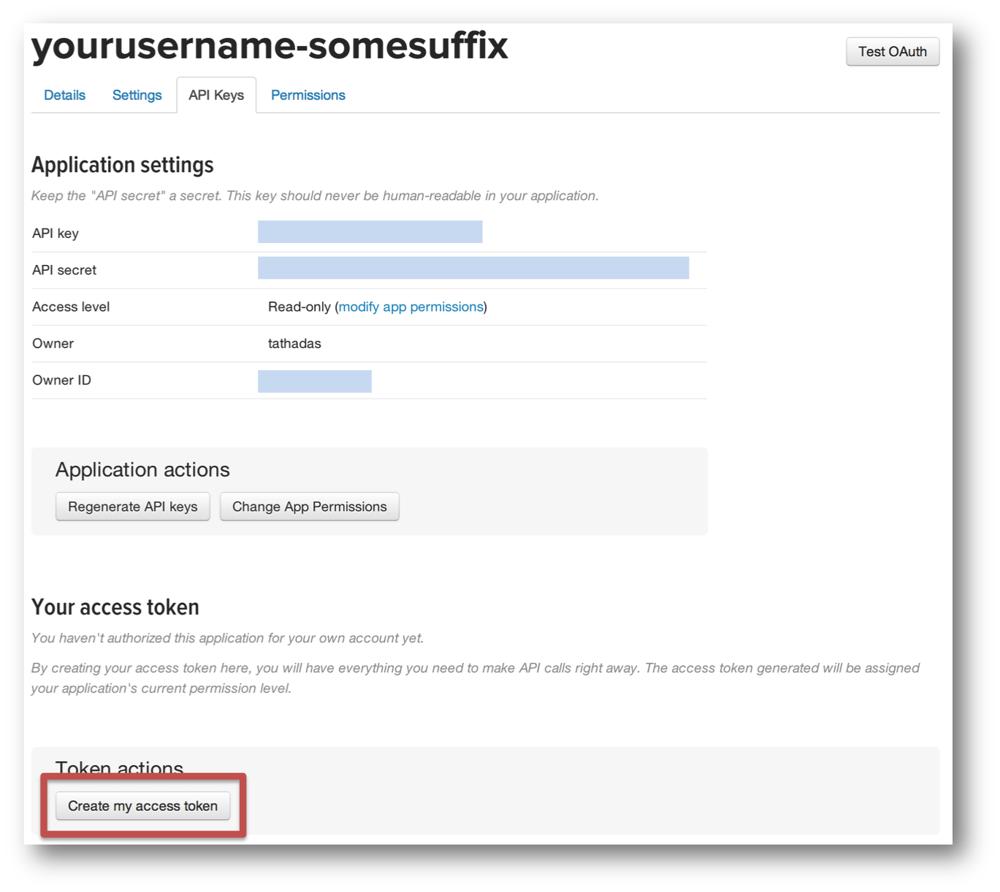
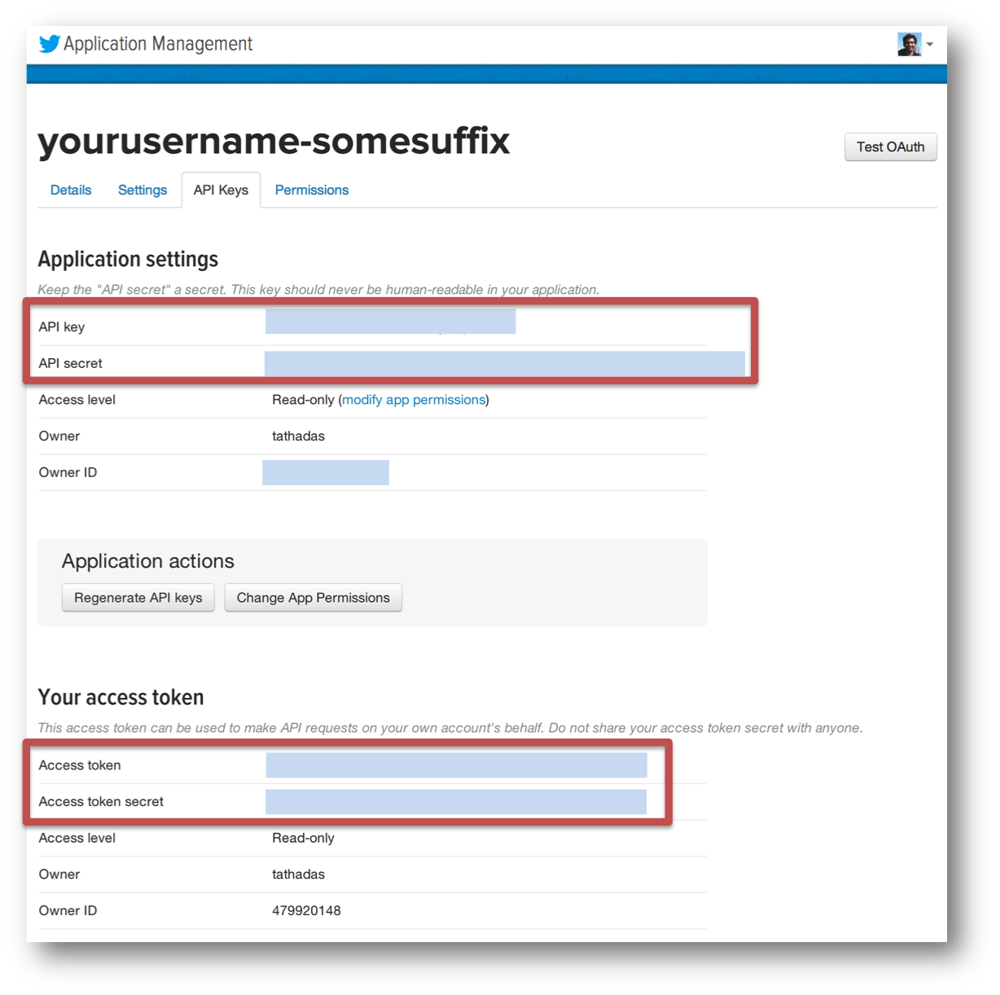

Twitter Credential Setup
======

Since some of tutorials are based on Twitter’s sample tweet stream,
it is necessary to configure authentication with a Twitter account.
To do this, you will need to setup a consumer key+secret pair
and an access token+secret pair using a Twitter account.
Please follow the instructions below to setup these temporary
access keys with your Twitter account. These instructions will not require you
to provide your Twitter username/password. You will only be required
to provide the consumer key and access token pairs that you will generate,
which you can easily destroy once you have finished the tutorial.
So, your Twitter account will not be compromised in any way.

1. Open [Twitter’s Application Settings page](https://dev.twitter.com/apps).
   This page lists the set of Twitter-based applications that you own and
   have already created consumer keys and access tokens for.  
   This list will be empty if you have never created any applications.
   For the tutorial, create a new temporary application.
   To do this, click on the blue “Create a new application” button.
   The new application page should look the page shown below.
   Provide the required fields. The Name of the application must be globally unique,
   so using your Twitter username as a prefix to the name should ensure that.
   For example, set it as [your-twitter-handle]-test. For the Description,
   anything longer than 10 characters is fine. For the Website, similarly,
   any website is fine, but ensure that it is a fully-formed URL with the prefix _http://_.
   Then, click on the “Yes, I agree” checkbox below the Developer Rules of the Road.
   Finally, fill in the CAPTCHA and click on the blue “Create your Twitter application” button. 
   

2. Once you have created the application,
   you will be presented with a confirmation page similar
   to the one shown below. Click on the API Key tab. 
   

3. You should be able to see the API key and the API secret that have been generated.
   To generate the access token and the access token secret,
   click on the “Create my access token” button at the bottom of the page
   (marked in red in the figure below). Note that there will be a small green
   confirmation at the top of the page saying that the token has been generated. 
   

4. Finally, the page should look like the following. Notice the API Key, API Secret,
   Access Token and Access Token Secret. We are going to use these 4 keys
   in the next section. After you have finished this tutorial, you can delete
   all these keys by following the instructions at the end of the tutorial. 
   

Source of this page:

[https://databricks-training.s3.amazonaws.com/realtime-processing-with-spark-streaming.html#twitter-credential-setup](https://databricks-training.s3.amazonaws.com/realtime-processing-with-spark-streaming.html#twitter-credential-setup)
